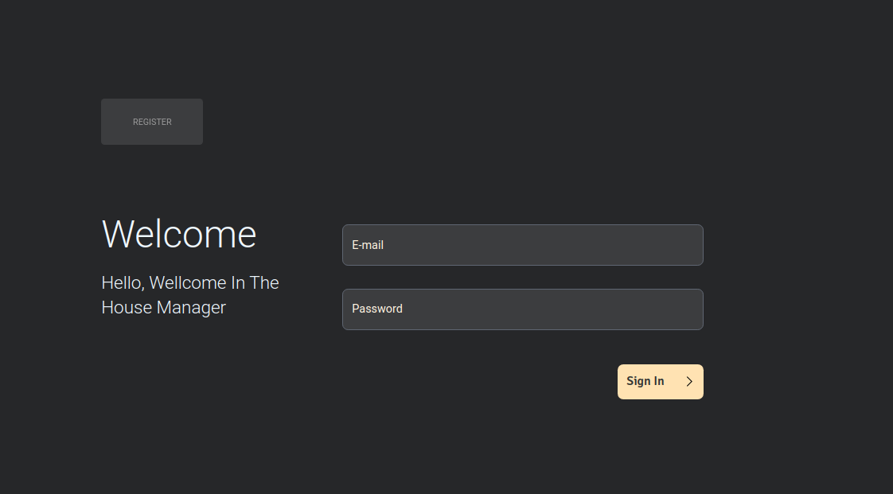
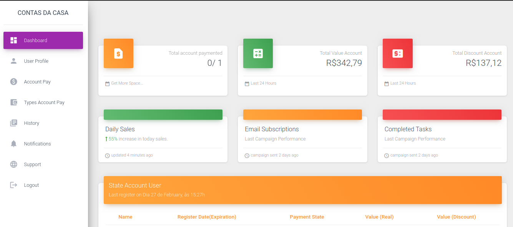
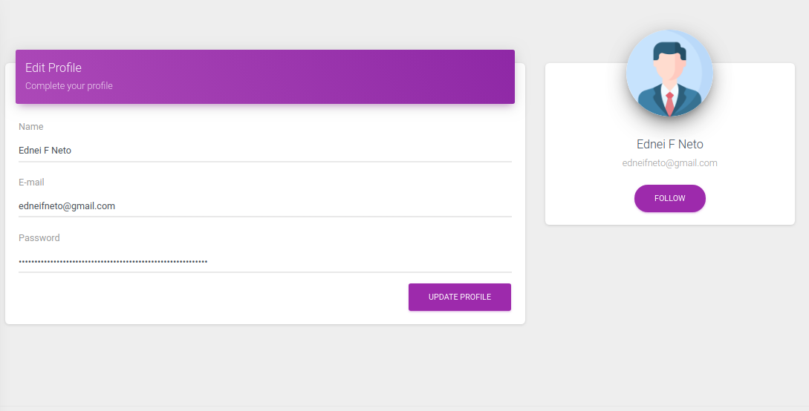
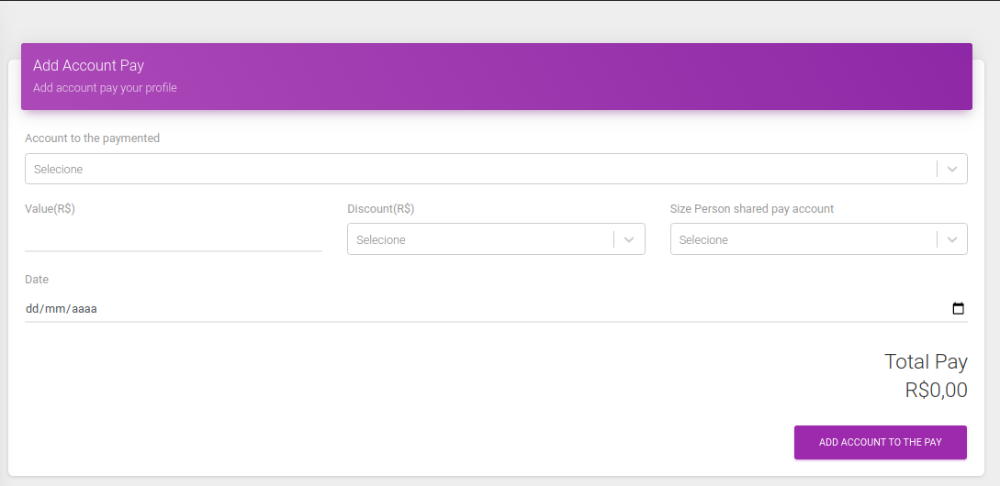
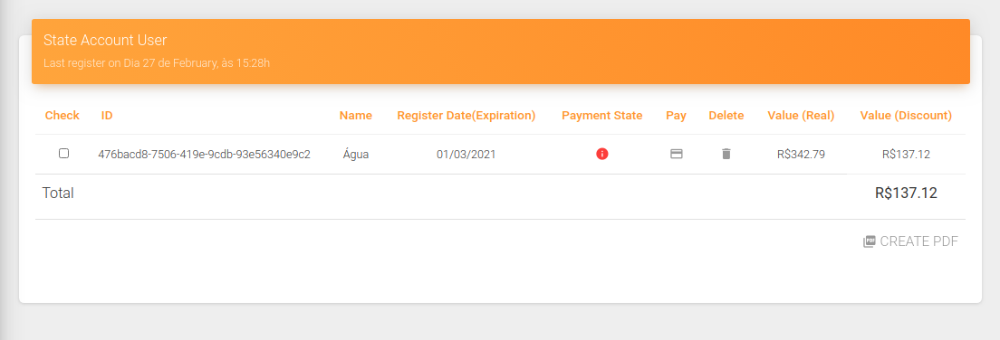

# House-Manager-front

# Introdução

Sistema criado para auxiliar no gerenciamento de contas, onde o usuário vai 
poder cadastrar suas contas e poder guardar histórico, receber notificação 
de contas vencidas.

## Screenshots

## Bibliotecas utilizadas
- [Material-icons](https://material.io/)
- [sweetalert](https://sweetalert.js.org/guides/)
- [unform-web and core](https://unform.dev/examples/react-select/)
- [axios](https://github.com/axios/axios)
- [date-fns](https://date-fns.org/docs/Getting-Started)
- [react](https://pt-br.reactjs.org/)

## Templete
- [creative-tim](https://www.creative-tim.com/)

## API
Api Utilizado para realizar as consultas, cadastro e edições [House-Manager-Back](https://github.com/EdneiFNeto/House-Manager-back).
